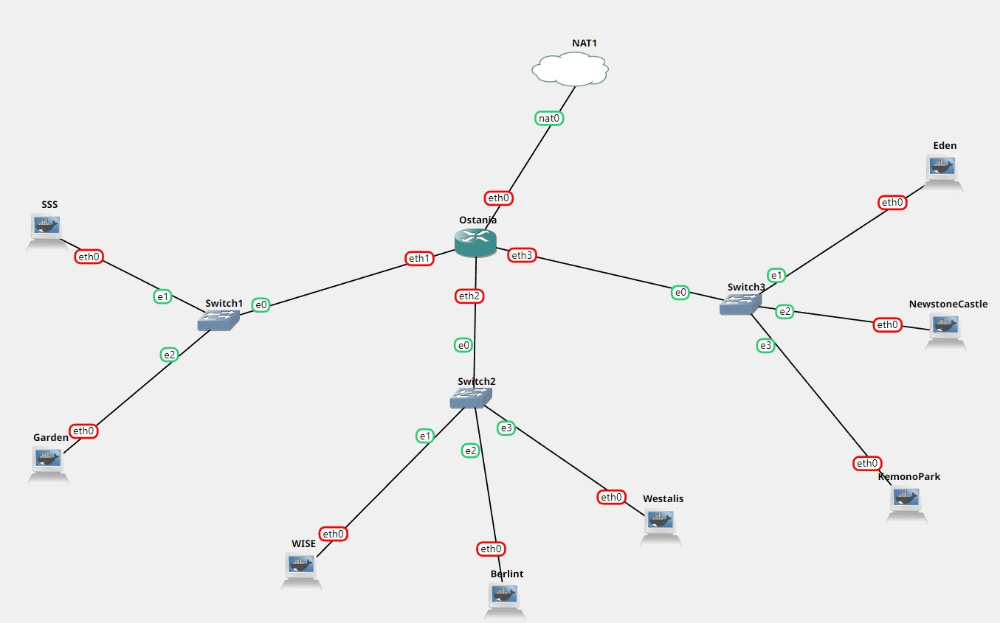

# Jarkom-Modul3-E14-2022

Lapres Praktikum Jarkom Modul 3

Dhafin Almas Nusantara - 5025201064

### Topologi



### Penjelasan

**No 1 & 2**

Loid bersama Franky berencana membuat peta tersebut dengan kriteria WISE sebagai DNS Server, Westalis sebagai DHCP Server, Berlint sebagai Proxy Server.dan Ostania sebagai DHCP Relay.Loid dan Franky menyusun peta tersebut dengan hati-hati dan teliti.

**Konfigurasi IP setiap node**

- Ostania (DHCP Relay)

```
auto eth0
iface eth0 inet dhcp

auto eth1
iface eth1 inet static
	address 192.199.1.1
	netmask 255.255.255.0

auto eth2
iface eth2 inet static
	address 192.199.2.1
	netmask 255.255.255.0

auto eth3
iface eth3 inet static
	address 192.199.3.1
	netmask 255.255.255.0
```

- Westalis (DHCP Server)

```
auto eth0
iface eth0 inet static
	address 192.199.2.4
	netmask 255.255.255.0
	gateway 192.199.2.1
```

- WISE (DNS Server)

```
auto eth0
iface eth0 inet static
	address 192.199.2.2
	netmask 255.255.255.0
	gateway 192.199.2.1
```

- Berlint (Proxy Server)

```
auto eth0
iface eth0 inet static
	address 192.199.2.3
	netmask 255.255.255.0
	gateway 192.199.2.1
```

Untuk akses internet, tambahkan konfigurasi nameserver di `/etc/resolv.conf` dan juga konfiogurasi iptables pada router Ostania agar node-node yang terhubung bisa mengakses internet juga.

```
echo "nameserver 192.168.122.1" >> /etc/resolv.conf
iptables -t nat -A POSTROUTING -o eth0 -j MASQUERADE -s 192.199.0.0/16
```

**Instalasi Tools**

- Ostania

```
apt update
apt install isc-dhcp-relay -y
```

- Wisetalis

```
apt update
apt install isc-dhcp-server -y
```

- Wise

```
apt update
apt install bind9 -y
```

- Berlint

```
apt update
apt-get install squid -y
```

**No 3 & 4**

Ada beberapa kriteria yang ingin dibuat oleh Loid dan Franky, yaitu:

- Semua client yang ada HARUS menggunakan konfigurasi IP dari DHCP Server.
- Client yang melalui Switch1 mendapatkan range IP dari [prefix IP].1.50 - [prefix IP].1.88 dan [prefix IP].1.120 - [prefix IP].1.155
- Client yang melalui Switch3 mendapatkan range IP dari [prefix IP].3.10 - [prefix IP].3.30 dan [prefix IP].3.60 - [prefix IP].3.85

**Konfigurasi**

- konfigurasi DHCP server, edit di `/etc/dhcp/dhcpd.conf`

```
subnet 192.199.1.0 netmask 255.255.255.0 {
    range 192.199.1.50 192.199.1.88;
    range 192.199.1.120 192.199.1.155;
    option routers 192.199.1.1;
    option broadcast-address 192.199.1.255;
}
subnet 192.199.2.0 netmask 255.255.255.0 {
}
subnet 192.199.3.0 netmask 255.255.255.0 {
    range 192.199.3.10 192.199.3.30;
    range 192.199.3.60 192.199.3.85;
    option routers 192.199.3.1;
    option broadcast-address 192.199.3.255;
}
```

- konfigurasi DHCP relay untuk interface yang mengarah ke switch1 dan switch3, pada `/etc/default/isc-dhcp-relay`

```
SERVERS="192.199.2.4" # IP Westalis
INTERFACES="eth1 eth2 eth3"
```

- Kemudian uncomment `#net.ipv4.ip_forward=1` untuk meng-enable IP Forwarding di `/etc/sysctl.conf`.

- rubah konfigurasi ip semua client menjadi dhcp

```
auto eth0
iface eth0 inet dhcp
```

**No 5**

Client mendapatkan DNS dari WISE dan client dapat terhubung dengan internet melalui DNS tersebut.

- pada DHCP server ,tambahkan perintah `option domain-name-servers`, agar client bisa terhubung ke internet melalui DNS yang diberikan, maka konfigurasinya menjadi seperti berikut

```
subnet 192.199.1.0 netmask 255.255.255.0 {
    range 192.199.1.50 192.199.1.88;
    range 192.199.1.120 192.199.1.155;
    option routers 192.199.1.1;
    option broadcast-address 192.199.1.255;
    option domain-name-servers 192.199.2.2;
}
subnet 192.199.2.0 netmask 255.255.255.0 {
}
subnet 192.199.3.0 netmask 255.255.255.0 {
    range 192.199.3.10 192.199.3.30;
    range 192.199.3.60 192.199.3.85;
    option routers 192.199.3.1;
    option broadcast-address 192.199.3.255;
    option domain-name-servers 192.199.2.2;
}
```

- Pada DNS server ,tambahkan konfigurasi untuk DNS option di /etc/bind/named.conf.options

```

options {
        directory "/var/cache/bind";
        forwarders {
            192.168.122.1;
        };
        allow-query{any;};
        auth-nxdomain no;    # conform to RFC1035
        listen-on-v6 { any; };
}
```

**\*Pada forwarders menggunakan IP NAT (mendapat dari IP Tables)**

**No 6**

Lama waktu DHCP server meminjamkan alamat IP kepada Client yang melalui Switch1 selama 5 menit sedangkan pada client yang melalui Switch3 selama 10 menit. Dengan waktu maksimal yang dialokasikan untuk peminjaman alamat IP selama 115 menit.

- Pada DHCP server ,tambahkan `default-lease-time` untuk default waktu peminjaman IP ke client dan juga `max-lease-time` untuk maksimal waktu untuk peminjaman IP ke client. Maka konfigurasi menjadi seperti berikut

```
subnet 192.199.1.0 netmask 255.255.255.0 {
    range 192.199.1.50 192.199.1.88;
    range 192.199.1.120 192.199.1.155;
    option routers 192.199.1.1;
    option broadcast-address 192.199.1.255;
    option domain-name-servers 192.199.2.2;
    default-lease-time 300;
    max-lease-time 6900;
}
subnet 192.199.2.0 netmask 255.255.255.0 {
}
subnet 192.199.3.0 netmask 255.255.255.0 {
    range 192.199.3.10 192.199.3.30;
    range 192.199.3.60 192.199.3.85;
    option routers 192.199.3.1;
    option broadcast-address 192.199.3.255;
    option domain-name-servers 192.199.2.2;
    default-lease-time 600;
    max-lease-time 6900;
}
```

**No 7**

Loid dan Franky berencana menjadikan Eden sebagai server untuk pertukaran informasi dengan alamat IP yang tetap dengan IP [prefix IP].3.13

- tambahkan konfigurasi fixed address. yaitu nama host dari client dan juga MAC Address client dari interface yang terhubung. Tambahkan pada `/etc/dhcp/dhcpd.conf`

```
host Eden {
    hardware ethernet 22:80:5a:6c:27:4c;
    fixed-address 192.199.3.13;
}
```

- Selanjutnya konfigurasi IP setiap node client menjadi DHCP, agar MAC Address tidak berubah ketika node dimatikan tambahkan konfigurasi untuk hardware address.

```
auto eth0
iface eth0 inet dhcp
hwaddress ether 22:80:5a:6c:27:4c;
```

**No 8**

SSS, Garden, dan Eden digunakan sebagai client Proxy agar pertukaran informasi dapat terjamin keamanannya, juga untuk mencegah kebocoran data. Pada Proxy Server di Berlint, Loid berencana untuk mengatur bagaimana Client dapat mengakses internet. Artinya setiap client harus menggunakan Berlint sebagai HTTP & HTTPS proxy.

- Pada Proxy server, pastikan squid telah terinstal kemudian di back up terlebih dahulu.

```
squid --version

mv /etc/squid/squid.conf /etc/squid/squid.conf.bak
```

- kemudian tambahkan baris perintah ini di `/etc/squid/squid.conf`. Dimana proxy servernya akan berjalan di `port 5000`

```
http_port 5000
visible_hostname Berlint
```

- pada client, `export http_proxy` supaya proxy servernya bisa digunakan oleh client.

```
export htpp_proxy="http://192.199.2.3:5000"
```

**No 9**

Pada Proxy Server di Berlint, Loid berencana untuk mengatur bagaimana Client dapat mengakses internet. Artinya setiap client harus menggunakan Berlint sebagai HTTP & HTTPS proxy. Adapun kriteria pengaturannya adalah sebagai berikut:

**1.** Client hanya dapat mengakses internet diluar (selain) hari & jam kerja (senin-jumat 08.00 - 17.00) dan hari libur (dapat mengakses 24 jam penuh)

- pada acl ditambahakan jam kerja `/etc/squid/acl.conf`

```
acl JAM_KERJA time MTWHF 08:00-17:00
```

- lalu pada `/etc/squid/squid.conf` ditambahkan

```
http_access deny WORKDAYS
http_access allow all
```

**2.** Adapun pada hari dan jam kerja sesuai nomor (1), client hanya dapat mengakses domain loid-work.com dan franky-work.com (IP tujuan domain dibebaskan)

- pada acl ditambahkan list domain tersebut

```
acl ALLOWED_DOMAIN dstdomain .loid-work.com .franky-work.com
```

- lalu pada `/etc/squid/squid.conf` ditambahkan

```
http_access allow JAM_KERJA ALLOWED_DOMAIN
```

**3.** Saat akses internet dibuka, client dilarang untuk mengakses web tanpa HTTPS. (Contoh web HTTP: http://example.com)

- pada acl ditambahkan regex untuk memblok string setiap akses http

```
acl BLOCKED url_regex ^http://.*$
```

- lalu pada `/etc/squid/squid.conf` ditambahkan

```
http_access deny BLOCKED
```
